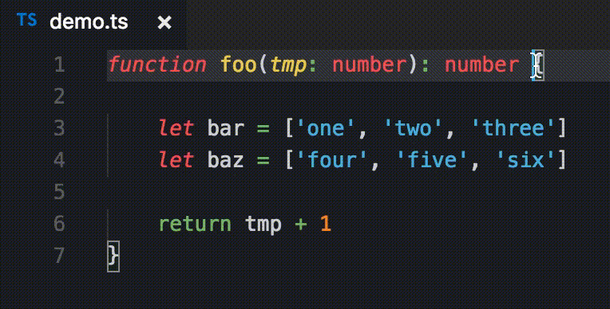
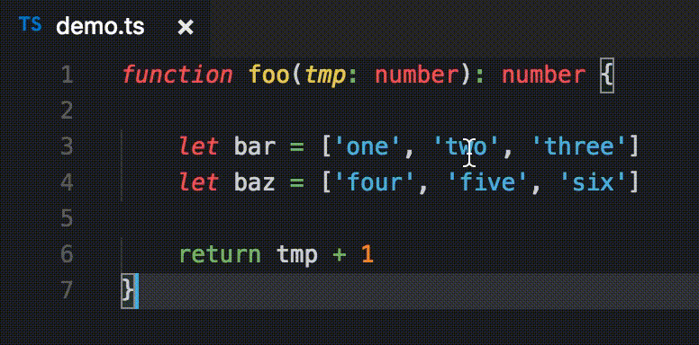

# bracket-jumper
Navigate by jumping from bracket to bracket!

## Features
Travel in an editor by bracket! Simply jump to the **nearest bracket left or right**, or "ascend" by jumping to the bracket enclosing the **nearest or matching level of scope**.

The following included commands jump simply to the nearest left or right bracket (system-specific keybindings are provided). See the demo below.
```
bracket-jumper.jumpLeft:    { Mac: ctrl+left, Windows/Linux: ctrl+alt+left }
bracket-jumper.jumpRight:   { Mac: ctrl+right, Windows/Linux: ctrl+alt+right }
bracket-jumper.selectLeft:  { Mac: ctrl+shift+left, Windows/Linux: ctrl+alt+shift+left }
bracket-jumper.selectRight: { Mac: ctrl+shift+right, Windows/Linux: ctrl+alt+shift+right }
```


The following commands "ascend", by jumping to the nearest or matching scope-delimiting bracket (system specific keybindings are provided).
```
bracket-jumper.ascendLeft:        { Mac: ctrl+up, Windows/Linux: ctrl+alt+up }
bracket-jumper.ascendRight:       { Mac: ctrl+down, Windows/Linux: ctrl+alt+down }
bracket-jumper.selectAscendLeft:  { Mac: ctrl+shift+up, Windows/Linux: ctrl+alt+shift+up }
bracket-jumper.selectAscendRight: { Mac: ctrl+shift+down, Windows/Linux: ctrl+alt+shift+down }
```


Currently recognizes the bracket characters `{, }, [, ], (, )`.

This extension replaces and extends functionality of VSCode's native `editor.action.jumpToBracket`.

## Issues

Please let me know of any bugs or feature requests via the issues page!

## Release Notes
See the [CHANGELOG](./CHANGELOG.md)
